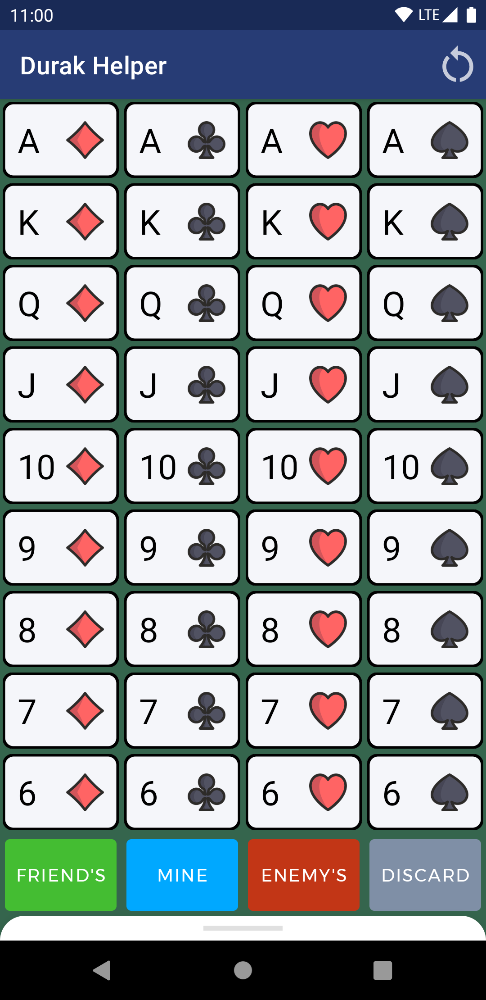
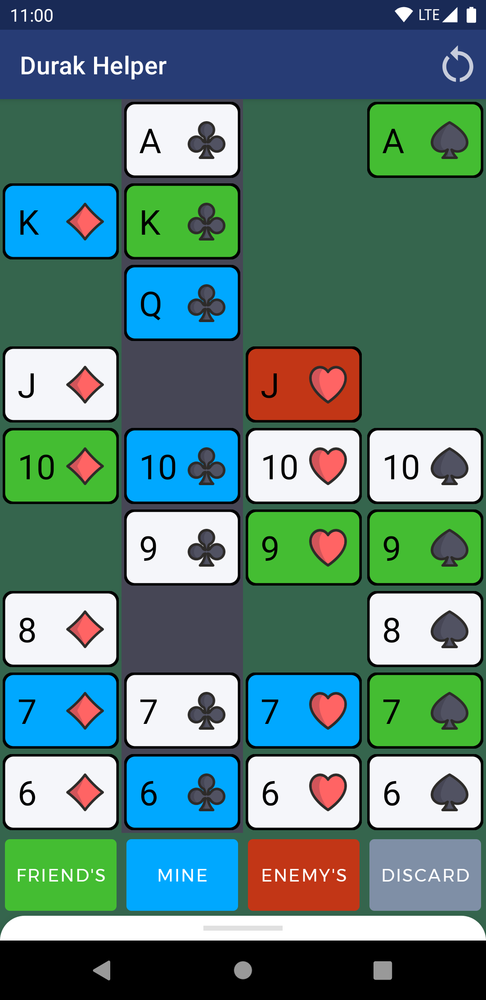

# [ EN 🇬🇧 | [RU 🇷🇺](README_RU.md) ] Durak Helper ♠️♥️♣️♦️

An app for tracking cards when playing card games.
Built with Jetpack Compose.

## Screenshots

New game | Two players (1vs1) | Three players |
--- | --- | --- |
 |  | 

## Built With

* [Kotlin](https://developer.android.com/kotlin)
* [Jetpack Compose](https://developer.android.com/jetpack/compose)
* [Architecture Components](https://developer.android.com/topic/libraries/architecture) (LiveData, ViewModel)
* [JUnit](https://junit.org/junit4/) for testing

## Usage
When playing durak card game, you should register all the cards you see using the app. By the end of the game you will know all the cards the opponents have. In most cases the right strategy choosing will let you win.

## Acknowledgements
Suit icons made by [Freepik from www.flaticon.com](https://www.flaticon.com/authors/freepik)
