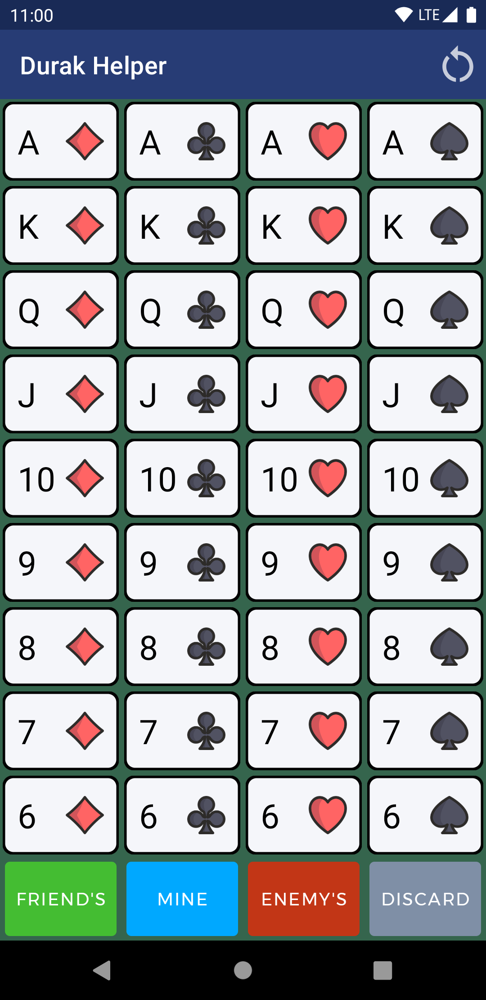
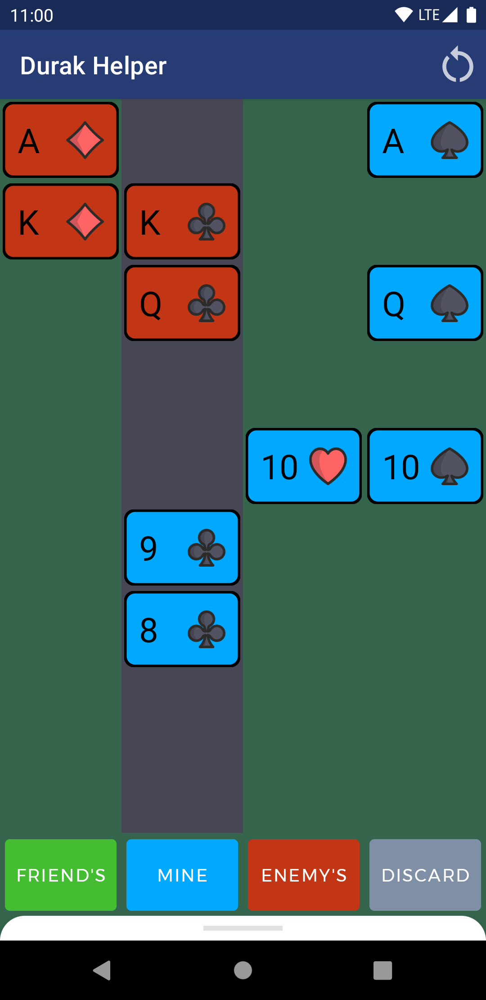
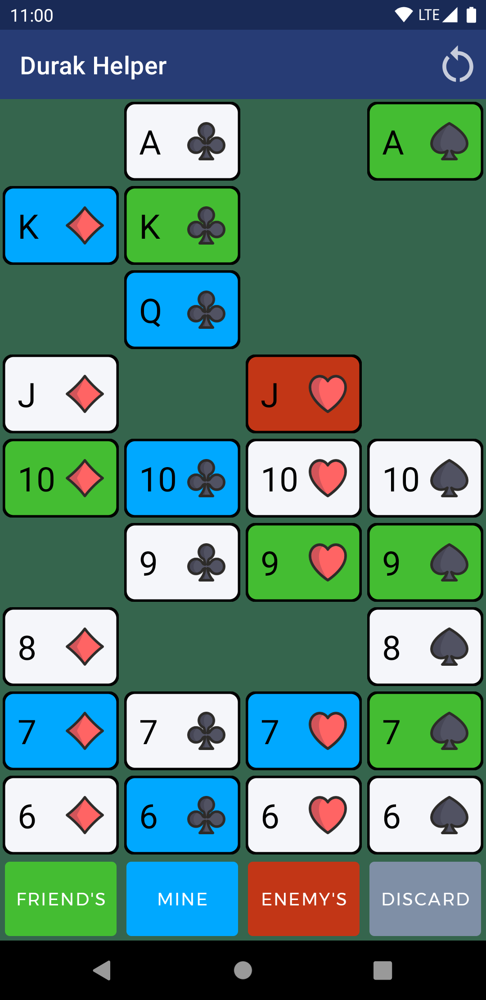

# [ [EN 🇬🇧](README.md) | RU 🇷🇺 ] Durak Helper ♠️♥️♣️♦️

Приложение для отслеживания карт при игре в дурака.
Написано с использованием Jetpack Compose.

## Скриншоты

Новая игра | Два игрока | Три игрока |
--- | --- | --- |
 |  | 

## Использованные технологии

* [Kotlin](https://developer.android.com/kotlin)
* [Jetpack Compose](https://developer.android.com/jetpack/compose)
* [Architecture Components](https://developer.android.com/topic/libraries/architecture) (LiveData, ViewModel)
* [JUnit](https://junit.org/junit4/) для тестов

## Как пользоваться приложением
Отмечая все попадающие на стол карты при игре в дурака, к концу игры можно узнать все карты в руке у противника. В большинстве случаев при грамотной игре эта информация поможет одержать победу.

## Благодарности
Иконки мастей сделаны [Freepik с www.flaticon.com](https://www.flaticon.com/authors/freepik)
